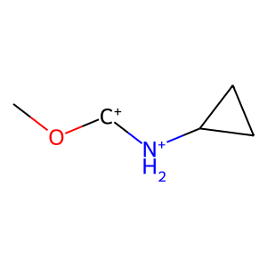

# Experiment Details
> from experiment with Diffusion
> on 2024-03-15 15-36
## Model
                                  
| KEY                | VALUE     |
|--------------------|-----------|
| num_nodes_features | 17        |
| num_edges_features | 4         |
| max_num_nodes      | 9         |
| max_num_edges      | 36        |
| latent_dimension   | 9         |
| down_channel       | (7, 5, 3) |
| time_emb_dim       | 6         |
                                  
## Dataset
- Dataset used [QM9](https://pytorch-geometric.readthedocs.io/en/latest/generated/torch_geometric.datasets.QM9.html)
                                 
| KEY                   | VALUE |
|-----------------------|-------|
| learning_rate         | 0.01  |
| epochs                | 50    |
| num_examples          | 6000  |
| batch_size            | 15    |
| training_percentage   | 0.7   |
| test_percentage       | 0.0   |
| val_percentage        | 0.3   |
| number_val_examples   | 1800  |
| number_train_examples | 4200  |
                                 
## Example data

Example Data from QM9 dataset Padded

#### adj :
> __SHAPE__ : (9, 9)
                                                       
| 1   | 2   | 3   | 4   | 5   | 6   | 7   | 8   | 9   |
|-----|-----|-----|-----|-----|-----|-----|-----|-----|
| 0.0 | 1.0 | 0.0 | 0.0 | 0.0 | 0.0 | 0.0 | 0.0 | 0.0 |
| 1.0 | 0.0 | 1.0 | 0.0 | 0.0 | 0.0 | 0.0 | 0.0 | 0.0 |
| 0.0 | 1.0 | 0.0 | 1.0 | 0.0 | 0.0 | 0.0 | 0.0 | 0.0 |
| 0.0 | 0.0 | 1.0 | 0.0 | 1.0 | 0.0 | 0.0 | 0.0 | 0.0 |
| 0.0 | 0.0 | 0.0 | 1.0 | 0.0 | 1.0 | 1.0 | 0.0 | 0.0 |
| 0.0 | 0.0 | 0.0 | 0.0 | 1.0 | 0.0 | 1.0 | 0.0 | 0.0 |
| 0.0 | 0.0 | 0.0 | 0.0 | 1.0 | 1.0 | 0.0 | 0.0 | 0.0 |
| 0.0 | 0.0 | 0.0 | 0.0 | 0.0 | 0.0 | 0.0 | 0.0 | 0.0 |
| 0.0 | 0.0 | 0.0 | 0.0 | 0.0 | 0.0 | 0.0 | 0.0 | 0.0 |
                                                       
#### features_nodes :
> __SHAPE__ : torch.Size([9, 17])
                                                                                                       
| 1   | 2   | 3   | 4   | 5   | 6   | 7   | 8   | 9   | 10  | 11  | 12  | 13  | 14  | 15  | 16  | 17  |
|-----|-----|-----|-----|-----|-----|-----|-----|-----|-----|-----|-----|-----|-----|-----|-----|-----|
| 0.0 | 1.0 | 0.0 | 0.0 | 0.0 | 1.0 | 0.0 | 0.0 | 0.0 | 0.0 | 0.0 | 0.0 | 0.0 | 0.0 | 0.0 | 0.0 | 1.0 |
| 0.0 | 0.0 | 0.0 | 1.0 | 0.0 | 0.0 | 0.0 | 1.0 | 0.0 | 0.0 | 0.0 | 0.0 | 0.0 | 1.0 | 0.0 | 0.0 | 0.0 |
| 0.0 | 1.0 | 0.0 | 0.0 | 0.0 | 1.0 | 0.0 | 0.0 | 0.0 | 0.0 | 0.0 | 0.0 | 0.0 | 0.0 | 1.0 | 0.0 | 0.0 |
| 0.0 | 0.0 | 1.0 | 0.0 | 0.0 | 0.0 | 1.0 | 0.0 | 0.0 | 0.0 | 0.0 | 0.0 | 0.0 | 1.0 | 0.0 | 0.0 | 0.0 |
| 0.0 | 1.0 | 0.0 | 0.0 | 0.0 | 1.0 | 0.0 | 0.0 | 0.0 | 0.0 | 0.0 | 0.0 | 0.0 | 0.0 | 1.0 | 0.0 | 0.0 |
| 0.0 | 1.0 | 0.0 | 0.0 | 0.0 | 1.0 | 0.0 | 0.0 | 0.0 | 0.0 | 0.0 | 0.0 | 0.0 | 0.0 | 0.0 | 1.0 | 0.0 |
| 0.0 | 1.0 | 0.0 | 0.0 | 0.0 | 1.0 | 0.0 | 0.0 | 0.0 | 0.0 | 0.0 | 0.0 | 0.0 | 0.0 | 0.0 | 1.0 | 0.0 |
| 0.0 | 0.0 | 0.0 | 0.0 | 0.0 | 0.0 | 0.0 | 0.0 | 0.0 | 0.0 | 0.0 | 0.0 | 0.0 | 0.0 | 0.0 | 0.0 | 0.0 |
| 0.0 | 0.0 | 0.0 | 0.0 | 0.0 | 0.0 | 0.0 | 0.0 | 0.0 | 0.0 | 0.0 | 0.0 | 0.0 | 0.0 | 0.0 | 0.0 | 0.0 |
                                                                                                       
#### features_edges :
> __SHAPE__ : torch.Size([36, 4])
                         
| 1   | 2   | 3   | 4   |
|-----|-----|-----|-----|
| 1.0 | 0.0 | 0.0 | 0.0 |
| 1.0 | 0.0 | 0.0 | 0.0 |
| 1.0 | 0.0 | 0.0 | 0.0 |
| 1.0 | 0.0 | 0.0 | 0.0 |
| 1.0 | 0.0 | 0.0 | 0.0 |
| 1.0 | 0.0 | 0.0 | 0.0 |
| 1.0 | 0.0 | 0.0 | 0.0 |
| 0.0 | 0.0 | 0.0 | 0.0 |
| 0.0 | 0.0 | 0.0 | 0.0 |
| 0.0 | 0.0 | 0.0 | 0.0 |
| 0.0 | 0.0 | 0.0 | 0.0 |
| 0.0 | 0.0 | 0.0 | 0.0 |
| 0.0 | 0.0 | 0.0 | 0.0 |
| 0.0 | 0.0 | 0.0 | 0.0 |
| 0.0 | 0.0 | 0.0 | 0.0 |
| 0.0 | 0.0 | 0.0 | 0.0 |
| 0.0 | 0.0 | 0.0 | 0.0 |
| 0.0 | 0.0 | 0.0 | 0.0 |
| 0.0 | 0.0 | 0.0 | 0.0 |
| 0.0 | 0.0 | 0.0 | 0.0 |
| 0.0 | 0.0 | 0.0 | 0.0 |
| 0.0 | 0.0 | 0.0 | 0.0 |
| 0.0 | 0.0 | 0.0 | 0.0 |
| 0.0 | 0.0 | 0.0 | 0.0 |
| 0.0 | 0.0 | 0.0 | 0.0 |
| 0.0 | 0.0 | 0.0 | 0.0 |
| 0.0 | 0.0 | 0.0 | 0.0 |
| 0.0 | 0.0 | 0.0 | 0.0 |
| 0.0 | 0.0 | 0.0 | 0.0 |
| 0.0 | 0.0 | 0.0 | 0.0 |
| 0.0 | 0.0 | 0.0 | 0.0 |
| 0.0 | 0.0 | 0.0 | 0.0 |
| 0.0 | 0.0 | 0.0 | 0.0 |
| 0.0 | 0.0 | 0.0 | 0.0 |
| 0.0 | 0.0 | 0.0 | 0.0 |
| 0.0 | 0.0 | 0.0 | 0.0 |
                         
#### num_nodes :
 - 7
#### num_edges :
 - 14
#### smiles :
 - [H][C+]([NH2+]C1([H])C([H])([H])C1([H])[H])OC([H])([H])[H]

