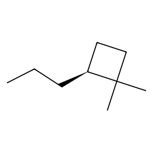

# Experiment Details
> from experiment with Diffusion
> on 2024-04-17 22-08
## Model
                                    
| KEY                | VALUE       |
|--------------------|-------------|
| num_nodes_features | 17          |
| num_edges_features | 4           |
| max_num_nodes      | 9           |
| max_num_edges      | 36          |
| latent_dimension   | 20          |
| down_channel       | (15, 10, 7) |
| time_emb_dim       | 6           |
                                    
## Dataset
- Dataset used [QM9](https://pytorch-geometric.readthedocs.io/en/latest/generated/torch_geometric.datasets.QM9.html)
                                 
| KEY                   | VALUE |
|-----------------------|-------|
| learning_rate         | 1e-05 |
| epochs                | 150   |
| num_examples          | 1000  |
| batch_size            | 128   |
| training_percentage   | 0.7   |
| test_percentage       | 0.0   |
| val_percentage        | 0.3   |
| number_val_examples   | 384   |
| number_train_examples | 768   |
                                 
## Example data

Example Data from QM9 dataset Padded

#### adj :
> __SHAPE__ : (9, 9)
                                                       
| 1   | 2   | 3   | 4   | 5   | 6   | 7   | 8   | 9   |
|-----|-----|-----|-----|-----|-----|-----|-----|-----|
| 0.0 | 1.0 | 0.0 | 0.0 | 0.0 | 0.0 | 0.0 | 0.0 | 0.0 |
| 1.0 | 0.0 | 1.0 | 0.0 | 0.0 | 0.0 | 0.0 | 0.0 | 0.0 |
| 0.0 | 1.0 | 0.0 | 1.0 | 0.0 | 0.0 | 0.0 | 0.0 | 0.0 |
| 0.0 | 0.0 | 1.0 | 0.0 | 1.0 | 1.0 | 0.0 | 0.0 | 0.0 |
| 0.0 | 0.0 | 0.0 | 1.0 | 0.0 | 0.0 | 1.0 | 0.0 | 0.0 |
| 0.0 | 0.0 | 0.0 | 1.0 | 0.0 | 0.0 | 1.0 | 1.0 | 1.0 |
| 0.0 | 0.0 | 0.0 | 0.0 | 1.0 | 1.0 | 0.0 | 0.0 | 0.0 |
| 0.0 | 0.0 | 0.0 | 0.0 | 0.0 | 1.0 | 0.0 | 0.0 | 0.0 |
| 0.0 | 0.0 | 0.0 | 0.0 | 0.0 | 1.0 | 0.0 | 0.0 | 0.0 |
                                                       
#### features_nodes :
> __SHAPE__ : torch.Size([9, 17])
                                                                                                       
| 1   | 2   | 3   | 4   | 5   | 6   | 7   | 8   | 9   | 10  | 11  | 12  | 13  | 14  | 15  | 16  | 17  |
|-----|-----|-----|-----|-----|-----|-----|-----|-----|-----|-----|-----|-----|-----|-----|-----|-----|
| 0.0 | 1.0 | 0.0 | 0.0 | 0.0 | 1.0 | 0.0 | 0.0 | 0.0 | 0.0 | 0.0 | 0.0 | 0.0 | 0.0 | 0.0 | 0.0 | 1.0 |
| 0.0 | 1.0 | 0.0 | 0.0 | 0.0 | 1.0 | 0.0 | 0.0 | 0.0 | 0.0 | 0.0 | 0.0 | 0.0 | 0.0 | 0.0 | 1.0 | 0.0 |
| 0.0 | 1.0 | 0.0 | 0.0 | 0.0 | 1.0 | 0.0 | 0.0 | 0.0 | 0.0 | 0.0 | 0.0 | 0.0 | 0.0 | 0.0 | 1.0 | 0.0 |
| 0.0 | 1.0 | 0.0 | 0.0 | 0.0 | 1.0 | 0.0 | 0.0 | 0.0 | 0.0 | 0.0 | 0.0 | 0.0 | 0.0 | 1.0 | 0.0 | 0.0 |
| 0.0 | 1.0 | 0.0 | 0.0 | 0.0 | 1.0 | 0.0 | 0.0 | 0.0 | 0.0 | 0.0 | 0.0 | 0.0 | 0.0 | 0.0 | 1.0 | 0.0 |
| 0.0 | 1.0 | 0.0 | 0.0 | 0.0 | 1.0 | 0.0 | 0.0 | 0.0 | 0.0 | 0.0 | 0.0 | 0.0 | 0.0 | 0.0 | 1.0 | 0.0 |
| 0.0 | 1.0 | 0.0 | 0.0 | 0.0 | 1.0 | 0.0 | 0.0 | 0.0 | 0.0 | 0.0 | 0.0 | 0.0 | 1.0 | 0.0 | 0.0 | 0.0 |
| 0.0 | 1.0 | 0.0 | 0.0 | 0.0 | 1.0 | 0.0 | 0.0 | 0.0 | 0.0 | 0.0 | 0.0 | 0.0 | 0.0 | 0.0 | 0.0 | 1.0 |
| 0.0 | 1.0 | 0.0 | 0.0 | 0.0 | 1.0 | 0.0 | 0.0 | 0.0 | 0.0 | 0.0 | 0.0 | 0.0 | 0.0 | 0.0 | 0.0 | 1.0 |
                                                                                                       
#### features_edges :
> __SHAPE__ : torch.Size([36, 4])
                         
| 1   | 2   | 3   | 4   |
|-----|-----|-----|-----|
| 1.0 | 0.0 | 0.0 | 0.0 |
| 1.0 | 0.0 | 0.0 | 0.0 |
| 1.0 | 0.0 | 0.0 | 0.0 |
| 1.0 | 0.0 | 0.0 | 0.0 |
| 1.0 | 0.0 | 0.0 | 0.0 |
| 1.0 | 0.0 | 0.0 | 0.0 |
| 1.0 | 0.0 | 0.0 | 0.0 |
| 1.0 | 0.0 | 0.0 | 0.0 |
| 1.0 | 0.0 | 0.0 | 0.0 |
| 0.0 | 0.0 | 0.0 | 0.0 |
| 0.0 | 0.0 | 0.0 | 0.0 |
| 0.0 | 0.0 | 0.0 | 0.0 |
| 0.0 | 0.0 | 0.0 | 0.0 |
| 0.0 | 0.0 | 0.0 | 0.0 |
| 0.0 | 0.0 | 0.0 | 0.0 |
| 0.0 | 0.0 | 0.0 | 0.0 |
| 0.0 | 0.0 | 0.0 | 0.0 |
| 0.0 | 0.0 | 0.0 | 0.0 |
| 0.0 | 0.0 | 0.0 | 0.0 |
| 0.0 | 0.0 | 0.0 | 0.0 |
| 0.0 | 0.0 | 0.0 | 0.0 |
| 0.0 | 0.0 | 0.0 | 0.0 |
| 0.0 | 0.0 | 0.0 | 0.0 |
| 0.0 | 0.0 | 0.0 | 0.0 |
| 0.0 | 0.0 | 0.0 | 0.0 |
| 0.0 | 0.0 | 0.0 | 0.0 |
| 0.0 | 0.0 | 0.0 | 0.0 |
| 0.0 | 0.0 | 0.0 | 0.0 |
| 0.0 | 0.0 | 0.0 | 0.0 |
| 0.0 | 0.0 | 0.0 | 0.0 |
| 0.0 | 0.0 | 0.0 | 0.0 |
| 0.0 | 0.0 | 0.0 | 0.0 |
| 0.0 | 0.0 | 0.0 | 0.0 |
| 0.0 | 0.0 | 0.0 | 0.0 |
| 0.0 | 0.0 | 0.0 | 0.0 |
| 0.0 | 0.0 | 0.0 | 0.0 |
                         
#### num_nodes :
 - 9
#### num_edges :
 - 18
#### smiles :
 - [H]C([H])([H])C([H])([H])C([H])([H])[C@@]1([H])C([H])([H])C([H])([H])C1(C([H])([H])[H])C([H])([H])[H]

