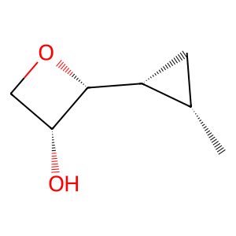

# Experiment Details

> from experiment with GRAPH VAE
> on 2024-04-17 19-54
> senza il Penalisation Term alla KL divergence

## Model

| KEY                | VALUE |
| ------------------ | ----- |
| num_nodes_features | 17    |
| num_edges_features | 4     |
| max_num_nodes      | 9     |
| max_num_edges      | 36    |
| latent_dimension   | 20    |

## Dataset

- Dataset used [QM9](https://pytorch-geometric.readthedocs.io/en/latest/generated/torch_geometric.datasets.QM9.html)

| KEY                   | VALUE |
| --------------------- | ----- |
| learning_rate         | 0.001 |
| epochs                | 10    |
| num_examples          | 1000  |
| batch_size            | 10    |
| training_percentage   | 0.7   |
| test_percentage       | 0.0   |
| val_percentage        | 0.3   |
| number_val_examples   | 300   |
| number_train_examples | 700   |

## Example data

Example Data from QM9 dataset Padded

#### adj :

> **SHAPE** : (9, 9)

| 1   | 2   | 3   | 4   | 5   | 6   | 7   | 8   | 9   |
| --- | --- | --- | --- | --- | --- | --- | --- | --- |
| 0.0 | 1.0 | 0.0 | 0.0 | 0.0 | 0.0 | 0.0 | 0.0 | 0.0 |
| 1.0 | 0.0 | 1.0 | 1.0 | 0.0 | 0.0 | 0.0 | 0.0 | 0.0 |
| 0.0 | 1.0 | 0.0 | 1.0 | 0.0 | 0.0 | 0.0 | 0.0 | 0.0 |
| 0.0 | 1.0 | 1.0 | 0.0 | 1.0 | 0.0 | 0.0 | 0.0 | 0.0 |
| 0.0 | 0.0 | 0.0 | 1.0 | 0.0 | 1.0 | 1.0 | 0.0 | 0.0 |
| 0.0 | 0.0 | 0.0 | 0.0 | 1.0 | 0.0 | 0.0 | 1.0 | 0.0 |
| 0.0 | 0.0 | 0.0 | 0.0 | 1.0 | 0.0 | 0.0 | 1.0 | 1.0 |
| 0.0 | 0.0 | 0.0 | 0.0 | 0.0 | 1.0 | 1.0 | 0.0 | 0.0 |
| 0.0 | 0.0 | 0.0 | 0.0 | 0.0 | 0.0 | 1.0 | 0.0 | 0.0 |

#### features_nodes :

> **SHAPE** : torch.Size([9, 17])

| 1   | 2   | 3   | 4   | 5   | 6   | 7   | 8   | 9   | 10  | 11  | 12  | 13  | 14  | 15  | 16  | 17  |
| --- | --- | --- | --- | --- | --- | --- | --- | --- | --- | --- | --- | --- | --- | --- | --- | --- |
| 0.0 | 1.0 | 0.0 | 0.0 | 0.0 | 1.0 | 0.0 | 0.0 | 0.0 | 0.0 | 0.0 | 0.0 | 0.0 | 0.0 | 0.0 | 0.0 | 1.0 |
| 0.0 | 1.0 | 0.0 | 0.0 | 0.0 | 1.0 | 0.0 | 0.0 | 0.0 | 0.0 | 0.0 | 0.0 | 0.0 | 0.0 | 1.0 | 0.0 | 0.0 |
| 0.0 | 1.0 | 0.0 | 0.0 | 0.0 | 1.0 | 0.0 | 0.0 | 0.0 | 0.0 | 0.0 | 0.0 | 0.0 | 0.0 | 0.0 | 1.0 | 0.0 |
| 0.0 | 1.0 | 0.0 | 0.0 | 0.0 | 1.0 | 0.0 | 0.0 | 0.0 | 0.0 | 0.0 | 0.0 | 0.0 | 0.0 | 1.0 | 0.0 | 0.0 |
| 0.0 | 1.0 | 0.0 | 0.0 | 0.0 | 1.0 | 0.0 | 0.0 | 0.0 | 0.0 | 0.0 | 0.0 | 0.0 | 0.0 | 1.0 | 0.0 | 0.0 |
| 0.0 | 0.0 | 0.0 | 1.0 | 0.0 | 0.0 | 0.0 | 1.0 | 0.0 | 0.0 | 0.0 | 0.0 | 0.0 | 1.0 | 0.0 | 0.0 | 0.0 |
| 0.0 | 1.0 | 0.0 | 0.0 | 0.0 | 1.0 | 0.0 | 0.0 | 0.0 | 0.0 | 0.0 | 0.0 | 0.0 | 0.0 | 0.0 | 1.0 | 0.0 |
| 0.0 | 1.0 | 0.0 | 0.0 | 0.0 | 1.0 | 0.0 | 0.0 | 0.0 | 0.0 | 0.0 | 0.0 | 0.0 | 0.0 | 1.0 | 0.0 | 0.0 |
| 0.0 | 0.0 | 0.0 | 1.0 | 0.0 | 0.0 | 0.0 | 1.0 | 0.0 | 0.0 | 0.0 | 0.0 | 0.0 | 0.0 | 1.0 | 0.0 | 0.0 |

#### features_edges :

> **SHAPE** : torch.Size([36, 4])

| 1   | 2   | 3   | 4   |
| --- | --- | --- | --- |
| 1.0 | 0.0 | 0.0 | 0.0 |
| 1.0 | 0.0 | 0.0 | 0.0 |
| 1.0 | 0.0 | 0.0 | 0.0 |
| 1.0 | 0.0 | 0.0 | 0.0 |
| 1.0 | 0.0 | 0.0 | 0.0 |
| 1.0 | 0.0 | 0.0 | 0.0 |
| 1.0 | 0.0 | 0.0 | 0.0 |
| 1.0 | 0.0 | 0.0 | 0.0 |
| 1.0 | 0.0 | 0.0 | 0.0 |
| 1.0 | 0.0 | 0.0 | 0.0 |
| 0.0 | 0.0 | 0.0 | 0.0 |
| 0.0 | 0.0 | 0.0 | 0.0 |
| 0.0 | 0.0 | 0.0 | 0.0 |
| 0.0 | 0.0 | 0.0 | 0.0 |
| 0.0 | 0.0 | 0.0 | 0.0 |
| 0.0 | 0.0 | 0.0 | 0.0 |
| 0.0 | 0.0 | 0.0 | 0.0 |
| 0.0 | 0.0 | 0.0 | 0.0 |
| 0.0 | 0.0 | 0.0 | 0.0 |
| 0.0 | 0.0 | 0.0 | 0.0 |
| 0.0 | 0.0 | 0.0 | 0.0 |
| 0.0 | 0.0 | 0.0 | 0.0 |
| 0.0 | 0.0 | 0.0 | 0.0 |
| 0.0 | 0.0 | 0.0 | 0.0 |
| 0.0 | 0.0 | 0.0 | 0.0 |
| 0.0 | 0.0 | 0.0 | 0.0 |
| 0.0 | 0.0 | 0.0 | 0.0 |
| 0.0 | 0.0 | 0.0 | 0.0 |
| 0.0 | 0.0 | 0.0 | 0.0 |
| 0.0 | 0.0 | 0.0 | 0.0 |
| 0.0 | 0.0 | 0.0 | 0.0 |
| 0.0 | 0.0 | 0.0 | 0.0 |
| 0.0 | 0.0 | 0.0 | 0.0 |
| 0.0 | 0.0 | 0.0 | 0.0 |
| 0.0 | 0.0 | 0.0 | 0.0 |
| 0.0 | 0.0 | 0.0 | 0.0 |

#### num_nodes :

- 9

#### num_edges :

- 20

#### smiles :

- [H]O[C@]1([H])C([H])([H])O[C@]1([H])[C@]1([H])C([H])([H])[C@]1([H])C([H])([H])[H]

